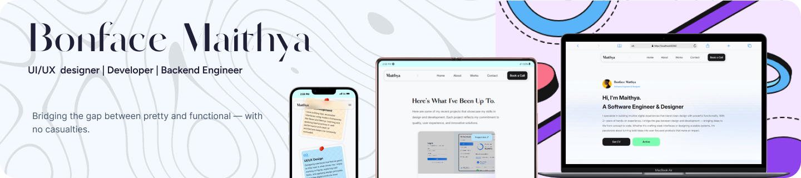
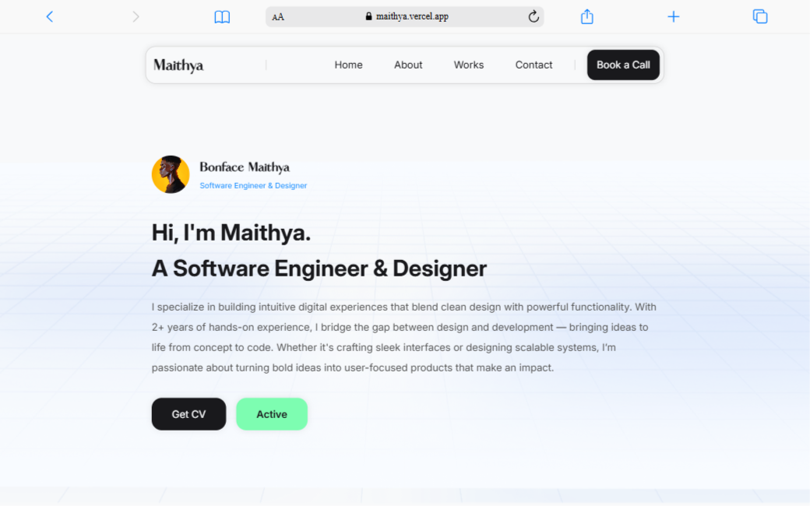

## PLP JULY 2025 COHORT HACKATHON

[](https://maithya.vercel.app)
<br>
Welcome to my personal portfolio website — a clean, responsive, and fully custom-built site created for the **PLP July 2025 Hackathon**. This project was built using **HTML and CSS only**, with no frameworks or JavaScript involved.

### Overview

This portfolio showcases who I am — a creative software engineer & designer based in Kenya — and the kind of work I love doing.<br>

### Features <br>

🔹 A custom-designed Landing page<br>
🔹 About section detailing my journey<br>
🔹 Contact section with basic call-to-action<br>
🔹 Mobile Responsive layout<br>
🔹 Featured project cards with subtle gradients<br>
🔹 Custom font: _Pardell_ and _Inter_<br>

Built with accessibility and mobile responsiveness in mind, this site reflects both my technical skills and my visual design thinking.

### Challenge constraints

✅ No JavaScript (HTML & CSS only)<br>
✅ Clean, modern, and user — friendly design<br>
✅ Fully mobile responsive <br>
✅ Well-organized file structure<br>
✅ Semantic HTML tags<br>

### Project structure

> _✦ Coming soon._

### Preview

→ [Click here to view the live website](https://maithya.vercel.app) ✦



### Getting Started

To view or edit this project locally:

1. **Clone the repo:**
   ```bash
   git clone https://github.com/Maithy-a/plp-portfolio-hackathon.git
   ```
2. Navigate into the project folder:
   ```bash
     cd plp-portfolio-hackathon
   ```
3. Open index.html in your browser<br>
✦ You can also use an extension like Live Server in VS Code for live previews.


### Submission info

Hackathon Guide: _July2025Cohort_ ⟶ [Hackathon1](https://github.com/MuriithiEric/July2025Cohort-Hackathon1)<br>
Challenge Host: _Muriithi Eric_ ⟶ July 2025 Cohort<br>

> Feel free to fork, explore, and reach out with feedback or collaboration ideas!
